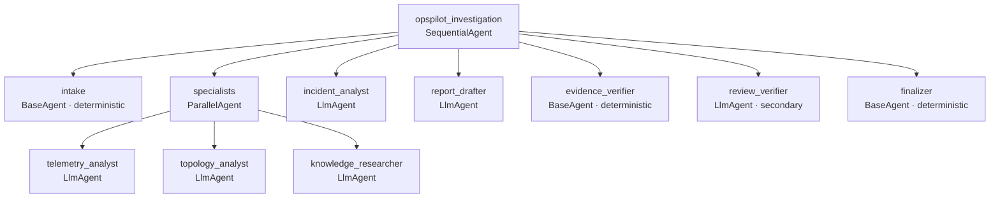
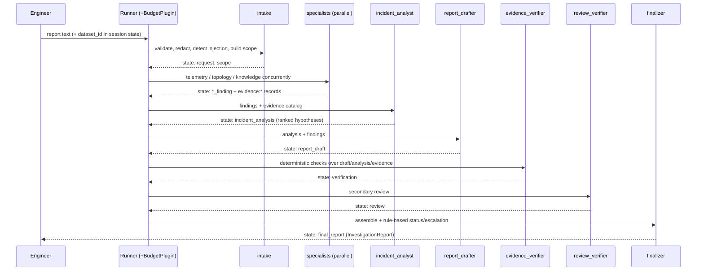
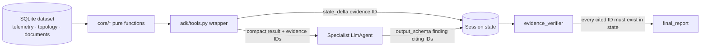
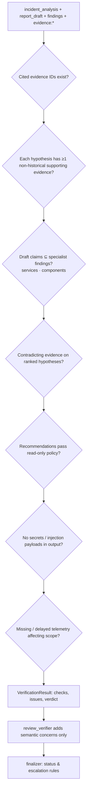

# ARCHITECTURE.md — OpsPilot AI

## Layering

```
opspilot/
  contracts/   Pydantic models: requests, evidence, tool I/O, findings, report  (no ADK)
  core/        Deterministic business logic: telemetry stats, topology graph,
               retrieval, hypothesis rules, verification, policy, security  (no ADK)
  datasets/    Synthetic world: topology, knowledge corpus, eval cases, generator
  adk/         Framework layer: tool wrappers, agents, callbacks, plugin,
               model factory (Gemini or mock), runner, sessions
  eval/        Evaluation harness and metrics
  cli.py       `opspilot` command: build-data, investigate, demo, eval, show
adk_apps/opspilot_ai/agent.py   exposes `root_agent` for `adk web` / `adk api_server`
```

Rule: `contracts/` and `core/` never import `google.adk`. The framework layer
adapts core functions into ADK tools and agents.

## Agent hierarchy



With `OPSPILOT_MAX_INVESTIGATION_ROUNDS=2`, specialists through
`evidence_verifier` run inside a `LoopAgent` (max 2 rounds) ending in a
deterministic `reinvestigation_gate` that retries failed stages; see
[docs/orchestration.md](docs/orchestration.md#optional-re-investigation-rounds).

## Task flow



## Evidence flow

Tools are pure functions in `core/`. The ADK wrapper for each tool calls the
core function, then registers every returned `Evidence` object in session state
under `evidence:<ID>`. IDs are content-derived (`EV-TEL-1a2b3c4d`), so a repeated
call yields the same ID (idempotent) and parallel agents never collide.



Large data (raw telemetry series, full documents) never enter session state;
evidence records hold a short summary, the source reference (table/entity/
metric/window or document ID) and a few key numbers.

## Verification process



Status rules (finalizer, deterministic):

| Status | Condition |
|---|---|
| `failed` | Run aborted (timeout/budget/exception) **or** all three specialists failed. |
| `inconclusive` | No hypothesis with non-historical support while anomalies exist, **or** a specialist failed, **or** critical telemetry missing for the leading hypothesis' component. |
| `requires_human_review` | Verification issues of severity `error` (unsupported claims, invalid citations, policy violations), contradicting evidence on the top hypothesis, or review_verifier concerns. |
| `investigated` | Otherwise (including "no fault found" in normal operations). |

## Bounded execution

| Limit | Mechanism | Default |
|---|---|---|
| Model requests | `RunConfig.max_llm_calls` + `BudgetPlugin.before_model_callback` | 40 |
| Tool invocations | `BudgetPlugin.before_tool_callback` returns an error result once exceeded | 60 |
| Iterations per agent | per-agent model-call cap in `BudgetPlugin` | 8 |
| Investigation duration | `asyncio.timeout` around the run | 120 s |
| Output size | Pydantic `max_length` on report fields + finalizer truncation | see `config.py` |
| Retries | live: google-genai `HttpRetryOptions` (bounded attempts); no unbounded retries anywhere | 2 attempts |

## Sessions

`DatabaseSessionService` on SQLite (`var/sessions.db`) persists events and
state; investigations can be listed, inspected and resumed (stages whose
`output_key` already exists are skipped). Tests use `InMemorySessionService`.
Details: [docs/session_management.md](docs/session_management.md).
