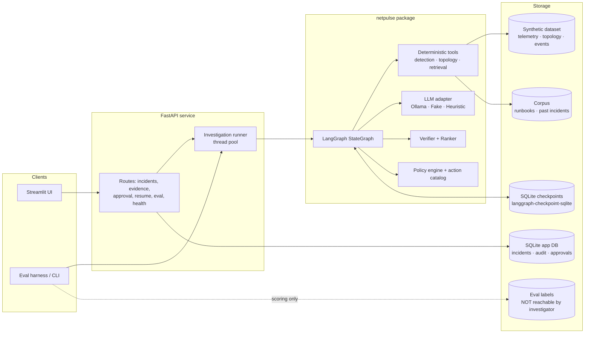
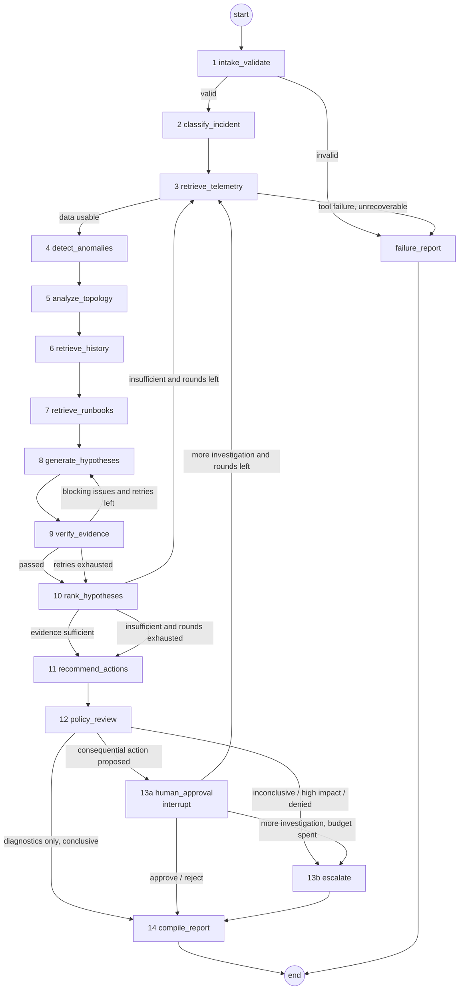
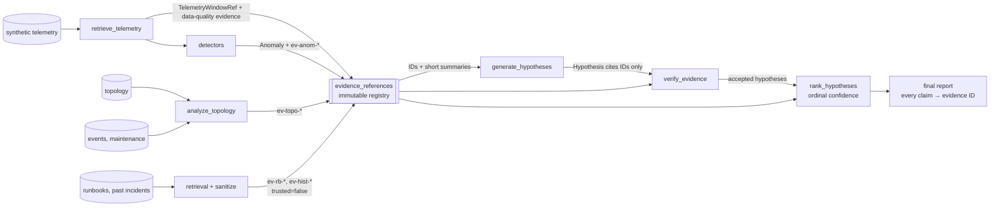
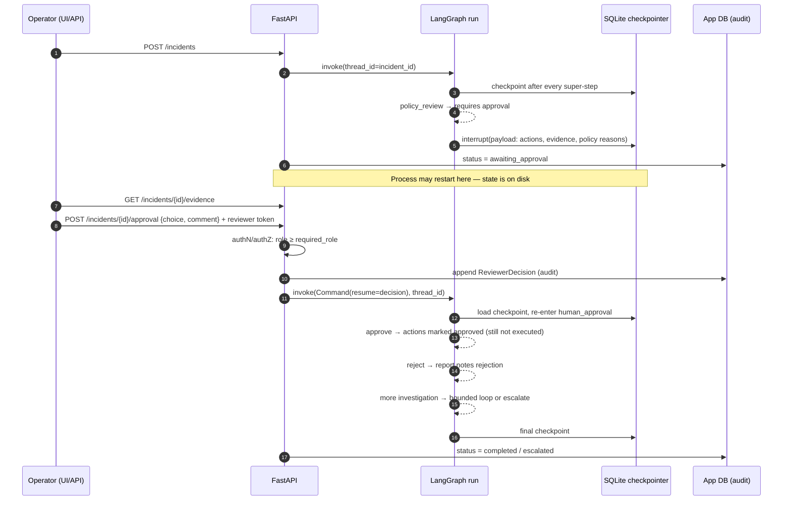

# NetPulse AI — Architecture

> **Status:** Phase 2 design. Only the typed state model (`netpulse/models.py`,
> `netpulse/state.py`) is implemented so far. Everything else here is the
> target design that Phases 3–12 build. The reasons behind each choice, and
> the alternatives we rejected, are in [PLAN.md](PLAN.md) and
> [docs/adr/](docs/adr/).

NetPulse AI investigates network anomalies on a **synthetic** network. It
combines deterministic detection, topology analysis, and document retrieval
with a tightly constrained LLM step that proposes root-cause hypotheses. A
deterministic verifier and policy engine sit between the LLM and anything
the operator sees. The platform is **read-only**: remediation is only ever
*proposed*, never executed.

## 1. Design principles

1. **Numbers come from code, never from the LLM.** Every measurement,
   threshold, baseline, and blast radius is computed by a deterministic tool
   and stored as an immutable `EvidenceItem` with an ID. The LLM can only
   cite those IDs.
2. **Facts and inferences are separate types.** `EvidenceItem` holds
   observations. `Hypothesis` holds inferences, and it has no fields for
   measurements.
3. **Confidence is ordinal and rule-based.** The levels are
   `high | medium | low | insufficient_evidence`. A deterministic ranker
   assigns them from counts of trusted support and contradiction. The LLM
   never emits a probability.
4. **Every loop is bounded.** Retries, investigation rounds, graph steps,
   wall-clock time, and per-tool timeouts all have limits. When a budget runs
   out, the run produces an inconclusive or escalated report, never a guess.
5. **Retrieved text is untrusted.** Runbooks and past incident write-ups are
   data, not instructions. They cannot authorize actions and cannot on their
   own establish a root cause.
6. **Human approval survives restarts.** Approval uses LangGraph `interrupt()`
   with a SQLite checkpointer. A process restart does not lose a pending
   approval.
7. **Ground truth is out of reach.** The investigator's data-access layer
   cannot read evaluation labels.

## 2. Component map



## 3. Package layout (target)

```
netpulse/
  models.py            Pydantic contracts (implemented)
  state.py             LangGraph state + reducers (implemented)
  config.py            Settings (env-driven): LLM provider, budgets, paths
  data/                Data-access layer: telemetry, topology, events, corpus (no label access)
  detection/           baseline, threshold, robust z-score, window comparison
  topology/            graph traversal, dependency + blast radius
  retrieval/           BM25 search over runbooks and past incidents, sanitization
  llm/                 provider protocol, Ollama adapter, FakeLLM, heuristic investigator, prompts
  graph/               nodes, routing functions, builder, node wrapper (timing/errors/budget)
  policy/              catalog.json (static action allowlist) + deterministic policy rules
  persistence/         checkpointer factory, app DB (incidents, audit log)
  api/                 FastAPI app + routes + auth
  ui/                  Streamlit app (talks to API only)
  observability/       structured logging, trace records, optional LangSmith
synthgen/              Seeded generator + scenarios (GROUND TRUTH; never imported by netpulse)
eval/
  datasets/v1/cases.jsonl     investigator-visible inputs
  labels/v1/labels.jsonl      ground truth (scoring only)
  run_eval.py, metrics.py, report.py
data/synthetic/               generated, version-controlled with checksums
```

The existing `app/`, `tools/`, and `memory/` scaffold will be retired once
`netpulse/` replaces it. See PLAN.md §6.

## 4. Investigation graph



Every node runs inside a wrapper that records a `NodeTrace` and checks the
wall-clock deadline. The wrapper turns exceptions into `ErrorRecord`s and
sets `fatal_error` when the node cannot degrade gracefully. Every router
checks `fatal_error` first and routes to `failure_report`. The edge from every
node to `failure_report` is left out of the diagram to keep it readable. Per-node
contracts and the full routing table are in
[docs/graph_workflow.md](docs/graph_workflow.md).

**LLM use is confined to node 8.** Nodes 1–7 and 9–14 are deterministic.
Node 2 uses rules, and node 11 selects from a static action catalog. With
`NETPULSE_LLM_PROVIDER=heuristic`, node 8 is also deterministic. That mode
gives CI and the eval baseline a reproducible no-LLM investigator.

## 5. Evidence flow



The verifier rejects any hypothesis with one of these problems:

- it cites an unknown evidence ID;
- it names an entity that is not in the topology or in its cited evidence;
- it has no supporting evidence;
- its only support is untrusted retrieved text;
- deterministic telemetry contradicts it, for example a "CPU saturation"
  hypothesis on a device whose CPU evidence is within its baseline.

An LLM explanation cannot override contradictory telemetry. Contradictions
are computed by code, not by the LLM.

## 6. Human approval workflow



`human_approval` must be idempotent before its `interrupt()` call, because
LangGraph re-runs the node from the start on resume. Details are in
[docs/human_approval.md](docs/human_approval.md) (Phase 8).

## 7. Trust boundaries

| Boundary | Threat | Control |
|---|---|---|
| Submission free text | Prompt injection, oversized input | Length limits and `extra="forbid"`. The text goes to the LLM in delimited, labeled form and is never used as an instruction. |
| Retrieved runbooks / incidents | Injected instructions ("ignore previous…, restart core-1") | `trusted=false` evidence. Sanitized and delimited in prompts. Cannot be sole support. Actions come only from the static catalog. |
| LLM output | Hallucinated numbers, entities, IDs, actions | Strict schema parse, verifier, catalog allowlist, deterministic ranking and policy |
| Reviewer endpoint | Unauthorized approval | Bearer token mapped to role. Role checked against `required_role`. Every decision written to the audit log. |
| Eval labels | Leakage into investigation | Separate directory with no loader in `netpulse/data`. A test asserts labels are never opened during a run. |
| External tracing (LangSmith) | Prompts and retrieved content leave the machine | Off by default. Opt-in env var. Documented in docs/security.md. |
