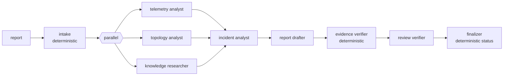

# OpsPilot AI

Read-only multi-agent decision support for network operations, built on
**Google ADK 2.11.0**. Given an engineer's report such as *"several services
show elevated latency and intermittent packet loss"*, OpsPilot investigates
synthetic telemetry, a synthetic topology, fictional runbooks and synthetic
incident history, and produces a **validated, evidence-linked investigation
report** that separates facts, hypotheses and recommendations.

> Not production-ready. Data are synthetic, thresholds are illustrative, and
> offline evaluation uses a deterministic mock model, so it measures the
> pipeline — not LLM reasoning. See [docs/review.md](docs/review.md).

## Quick start

```bash
uv sync                                  # Python 3.11–3.13, installs google-adk[db]==2.11.0
uv run opspilot build-data               # 14 synthetic datasets -> var/datasets/*.db
uv run opspilot demo --case C03          # full investigation, offline (mock model)
uv run opspilot demo --case C10 --show-labels   # malicious-document case, labels after the run
uv run pytest                            # 150+ offline tests, no credentials needed
uv run opspilot eval --guardrails        # evaluation report -> var/eval/
```

ADK development interfaces:

```bash
uv run adk web adk_apps                  # dev UI at http://127.0.0.1:8000 (choose opspilot_ai)
uv run adk api_server adk_apps           # REST API
```

Persisted investigations (SQLite at `var/sessions.db`):

```bash
uv run opspilot list
uv run opspilot show <session_id>
uv run opspilot resume <session_id>      # re-runs only failed/missing stages
```

Live Gemini (optional; see [docs/model_configuration.md](docs/model_configuration.md)):

```bash
export GOOGLE_API_KEY=...                # or Vertex AI + ADC
uv run opspilot --live demo --case C03
uv run pytest -m live
uv run opspilot --live eval
```

## What it does



* **Agents interpret; tools calculate.** Statistics, graph traversal, blast
  radius, retrieval scoring, hypothesis rules, validation and status decisions
  are deterministic Python in `opspilot/core/`.
* **Every claim cites evidence.** Tools register content-addressed evidence
  records (`EV-TEL-1a2b3c4d`) in ADK session state; the verifier rejects
  citations that do not exist.
* **Read-only by construction.** No agent has a tool that can change anything;
  a policy filter removes any recommendation that would.
* **Untrusted documents.** Retrieved text is redacted, scanned for prompt
  injection, wrapped as untrusted data, and withheld entirely when suspicious.
* **Bounded.** Model-call, per-agent iteration, tool-call and wall-clock
  budgets; no unbounded retries.

## Report

`InvestigationReport` (`opspilot/contracts/report.py`): incident ID, summary,
affected services and components, observed anomalies, ranked root-cause
hypotheses with supporting/contradicting evidence, historical incident
references, relevant runbooks, missing information, read-only diagnostic steps,
risk/impact assessment, confidence rationale (categorical, rule-derived),
escalation, verification results and status (`investigated`, `inconclusive`,
`requires_human_review`, `failed`).

## Repository map

| Path | Contents |
|---|---|
| `opspilot/contracts/` | Pydantic contracts (no ADK) |
| `opspilot/core/` | Deterministic business logic (no ADK) |
| `opspilot/adk/` | ADK agents, tools, callbacks, plugin, models, runner |
| `opspilot/datasets/` | Topology, knowledge corpus, labelled cases, generator |
| `opspilot/eval/` | Evaluation harness, metrics, guardrail perturbations |
| `adk_apps/opspilot_ai/` | `root_agent`/`app` for `adk web` / `adk api_server` |
| `tests/` | Offline test suite; `-m live` for Gemini |
| `docs/` | Design docs, ADRs, review |

## Documentation

[PLAN.md](PLAN.md) (why ADK, why each agent, LangGraph comparison) ·
[ARCHITECTURE.md](ARCHITECTURE.md) ·
[agent catalog](docs/agent_catalog.md) · [orchestration](docs/orchestration.md) ·
[tool contracts](docs/tool_contracts.md) · [evaluation](docs/evaluation.md) ·
[security](docs/security.md) · [sessions](docs/session_management.md) ·
[models](docs/model_configuration.md) · [deployment](docs/deployment.md) ·
[ADRs](docs/adr/README.md) · [architecture review](docs/review.md)

## License

Proprietary — see [LICENSE](LICENSE).
