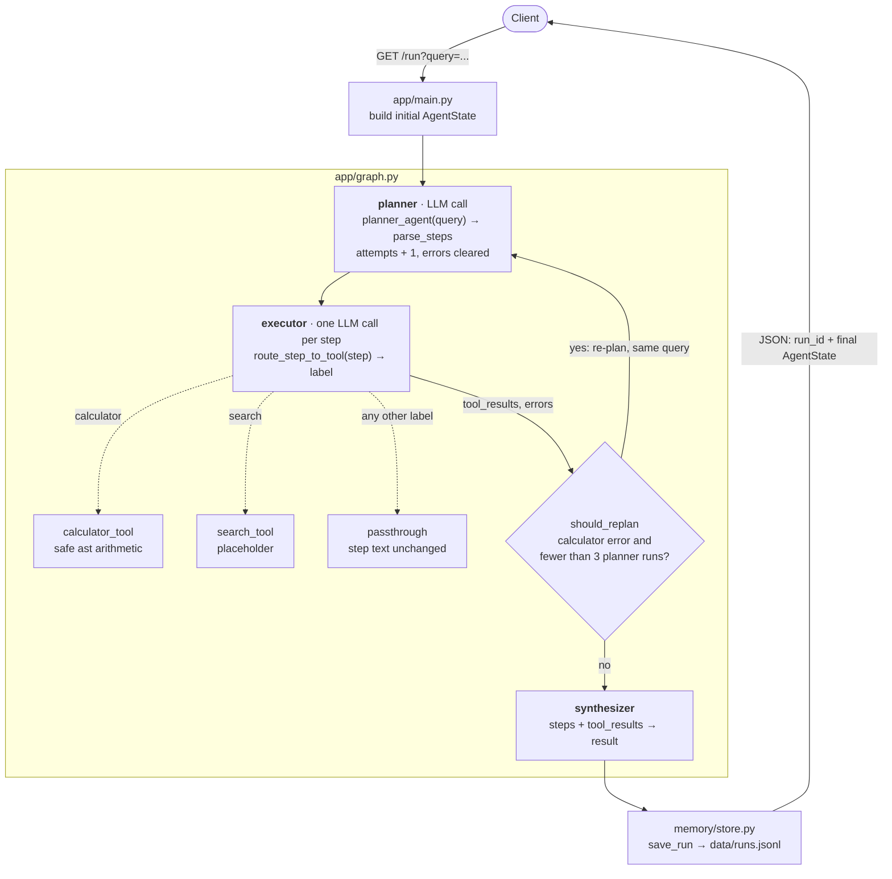

# agent-system

A FastAPI service wrapping a multi-step [LangGraph](https://github.com/langchain-ai/langgraph)
agent. You send a natural-language query to `GET /run`; the agent breaks it
into steps, runs each step through a tool, re-plans if a tool fails, and
returns the whole run (plan, per-step tool output, final summary) as JSON.
Every run is also saved to a local JSON Lines file.

> **Status:** early-stage. The plan → execute → synthesize loop, LLM-based
> tool routing, safe calculator and run storage are real and tested. The
> search tool is still a placeholder that echoes its input, and stored runs
> are not yet read back into the agent. See [Limitations](#limitations).

## Contents

- [How it works](#how-it-works)
- [Example](#example)
- [Getting started](#getting-started)
- [Running with Docker](#running-with-docker)
- [API reference](#api-reference)
- [Configuration](#configuration)
- [Run storage](#run-storage)
- [Testing and CI](#testing-and-ci)
- [Project layout](#project-layout)
- [Limitations](#limitations)
- [Development workflow](#development-workflow)
- [License](#license)

## How it works



The shaded box is the LangGraph `StateGraph` compiled in `app/graph.py`.
Solid arrows are control flow between graph nodes; dotted arrows are the
per-step dispatch inside `executor`.

The graph lives in `app/graph.py` and passes a single `AgentState`
(`app/state.py`) between three nodes:

1. **`planner`** calls an LLM (`openai/gpt-4o-mini` via OpenRouter) with the
   instruction "Break the task into steps", then `parse_steps` splits the
   reply into a list of step strings, stripping `1.`, `2)`, `-` and `*` list
   markers. Each planner run increments `attempts` and clears `errors`.
2. **`executor`** handles each step in order. `route_step_to_tool` asks the
   LLM to label the step `calculator`, `search` or `passthrough`, and the
   step goes to that tool:
   - `calculator`: `tools/calculator_tool.py` evaluates arithmetic with a
     restricted `ast` evaluator (numbers and `+ - * / // % **` only, never
     `eval`). A bare expression like `(2 + 3) * 4` is evaluated whole; from
     prose such as `What is 12 * 4?` it extracts the first `a op b` pair.
   - `search`: `tools/search_tool.py`, currently a placeholder returning
     `Search results for: <step>`.
   - `passthrough`, or any label the LLM returns that isn't one of the three:
     the step text is kept unchanged.

   Any step whose calculator result is `Error in calculation` is recorded in
   `errors`.
3. **Conditional edge (`should_replan`).** If `errors` is non-empty and fewer
   than 3 planner runs have happened (`_MAX_ATTEMPTS = 3`), control goes back
   to `planner` for a fresh plan. Otherwise it continues to `synthesizer`.
4. **`synthesizer`** pairs each step with its tool output into the `result`
   string.

`app/main.py` then saves the final state with `memory/store.py` and returns
it with the new `run_id`.

## Example

```bash
curl "http://localhost:8000/run?query=Budget+a+3-night+trip+to+Tokyo+at+120+per+night"
```

```json
{
  "run_id": "f531a21b-03e8-4c50-a4db-7516e1f3eff9",
  "query": "Budget a 3-night trip to Tokyo at 120 per night",
  "steps": [
    "Calculate 120 * 3 for the hotel cost",
    "Search for flights from London to Tokyo",
    "Summarize the trip budget"
  ],
  "tool_results": [
    "360",
    "Search results for: Search for flights from London to Tokyo",
    "Summarize the trip budget"
  ],
  "errors": [],
  "attempts": 1,
  "result": "Step: Calculate 120 * 3 for the hotel cost\nResult: 360\n\nStep: Search for flights from London to Tokyo\nResult: Search results for: Search for flights from London to Tokyo\n\nStep: Summarize the trip budget\nResult: Summarize the trip budget"
}
```

The steps depend on what the LLM plans, so a real run will differ. This
response was produced by the real graph, tools and storage with the two LLM
calls stubbed.

## Getting started

### Prerequisites

- Python 3.11 or newer
- [uv](https://docs.astral.sh/uv/) for dependency management
- An [OpenRouter](https://openrouter.ai/) API key (format `sk-or-v1-...`)

### Setup

```bash
git clone https://github.com/AshraHossain/agent-system.git
cd agent-system
uv sync                      # creates .venv with runtime + dev dependencies
```

Create a `.env` file in the repository root (it is gitignored):

```bash
OPENROUTER_API_KEY=sk-or-v1-your-key-here
```

### Run the server

```bash
uv run uvicorn app.main:app --reload --port 8000
```

Then call `GET /run` as in the [example](#example), or open
<http://localhost:8000/docs> for FastAPI's interactive Swagger UI.

`requirements.txt` lists the same runtime dependencies for plain `pip`
installs, but `pyproject.toml` + `uv.lock` are the source of truth.

## Running with Docker

```bash
docker build -t agent-system .
docker run -p 8000:8000 \
  -e OPENROUTER_API_KEY=sk-or-v1-your-key-here \
  -v "$PWD/data:/app/data" \
  agent-system
```

The image installs locked runtime dependencies with
`uv sync --frozen --no-install-project --no-dev` and runs
`uvicorn app.main:app` on port 8000.
The `-v` mount is optional: without it, saved runs live only inside the
container and disappear when it is removed.

## API reference

### `GET /run`

| Query parameter | Type | Required | Description |
|---|---|---|---|
| `query` | string | yes | The task for the agent, in natural language. |

Runs the full graph synchronously and returns `200` with:

| Field | Type | Description |
|---|---|---|
| `run_id` | string (UUID4) | ID under which the run was saved. |
| `query` | string | The query as received. |
| `steps` | string[] | The final plan, one entry per step. |
| `tool_results` | string[] | Output for each step, same order as `steps`. |
| `errors` | string[] | Steps from the final plan whose calculator call failed. Non-empty only if the attempt limit was reached. |
| `attempts` | integer | How many times the planner ran (1–3). |
| `result` | string | Each step paired with its result, as readable text. |

A missing `query` parameter returns FastAPI's standard `422`. If an LLM call
fails (bad key, network error, rate limit), the exception is not caught and
the request returns `500`.

## Configuration

| Setting | Where | Notes |
|---|---|---|
| `OPENROUTER_API_KEY` | environment or `.env` | Required. Read when `app/agents.py` is imported, so the server will not start without it. `OPENAI_API_KEY` is not used: the OpenAI SDK client is pointed at OpenRouter's OpenAI-compatible endpoint (`https://openrouter.ai/api/v1`). |
| Model | `app/agents.py` | `openai/gpt-4o-mini` for both planning and routing. OpenRouter needs the provider-prefixed model ID. |
| Planner attempt limit | `_MAX_ATTEMPTS` in `app/graph.py` | Default `3` planner runs (the first plan plus up to 2 re-plans). |
| Run store location | `STORE_PATH` in `memory/store.py` | Default `data/runs.jsonl` under the repository root. |

## Run storage

`memory/store.py` keeps an append-only JSON Lines file at `data/runs.jsonl`,
creating `data/` on first write. Each line is one run: `run_id` plus every
`AgentState` field. Existing lines are never rewritten.

```python
from memory.store import list_runs, load_run

for run_id in list_runs():          # oldest first
    run = load_run(run_id)          # dict, or None if the ID isn't found
    print(run_id, run["attempts"], run["result"][:60])
```

There is no HTTP route for stored runs yet, and the agent doesn't read past
runs. This is a record of runs, not memory. `load_run` scans the whole file,
which is fine at small scale.

## Testing and CI

```bash
uv run pytest
```

29 tests, all offline and needing no API key:

| File | Covers |
|---|---|
| `tests/test_tools.py` | Calculator arithmetic, nesting, prose extraction, rejection of code such as `__import__('os')`; search placeholder. |
| `tests/test_agents.py` | `parse_steps` for numbered, bulleted and unstructured planner output. |
| `tests/test_graph.py` | Tool routing in `execute_step`, error detection in `executor`, `synthesizer` output, and a full `app_graph.invoke()` run. |
| `tests/test_store.py` | Save/load round trip, missing IDs, ordering (uses a temporary store path). |
| `tests/test_main.py` | Repository structure and framework files. |

`tests/conftest.py` sets a placeholder `OPENROUTER_API_KEY` so the app
modules import offline. An autouse fixture also swaps the LLM router for a
keyword-based fake in every test, and tests that run the whole graph mock
`planner_agent`. A test that accidentally reached the real API would fail
with a connection or auth error rather than quietly pass.

GitHub Actions (`.github/workflows/ci.yml`) runs `uv sync` and
`uv run pytest` on Python 3.11 for every push to `master` and every pull
request targeting `master`.

## Project layout

```
agent-system/
├── app/
│   ├── main.py            FastAPI app; GET /run invokes the graph and saves the run
│   ├── graph.py           StateGraph: planner, executor, synthesizer, re-plan edge
│   ├── agents.py          LLM client, planner_agent, parse_steps, route_step_to_tool
│   └── state.py           AgentState TypedDict
├── tools/
│   ├── calculator_tool.py Safe ast-based arithmetic evaluator
│   └── search_tool.py     Placeholder search
├── memory/
│   └── store.py           Append-only JSON Lines run storage
├── tests/                 pytest suite (see above)
├── plugins/               Reserved plugin extension point (empty)
├── docs/                  Reserved for deeper documentation
├── .github/workflows/     CI
├── Dockerfile
├── pyproject.toml, uv.lock, requirements.txt
└── PLANNING.md, TASK.md, CLAUDE.md, CONTRIBUTING.md, agent_eval_log.md
```

## Limitations

- **Search is a placeholder.** `search_tool` echoes the step instead of
  calling a search API.
- **Re-planning isn't told what failed.** A re-plan sends the planner the
  same query, without the failed steps, so it can produce the same plan
  again.
- **The calculator needs digits and operators.** A step the router sends to
  the calculator but phrased in words, such as `Multiply 6 by 7`, returns
  `Error in calculation` and triggers a re-plan.
- **Only calculator failures count as errors.** Search and passthrough steps
  can't trigger a re-plan.
- **LLM cost scales with plan length.** Each planner run costs one planner
  call plus one routing call per step, and there can be up to 3 planner runs.
- **Synchronous and unauthenticated.** `/run` blocks for the whole run and has
  no auth or rate limiting, so don't expose it publicly as is.
- **Stored runs aren't used.** Runs are saved but never read back (see
  [Run storage](#run-storage)).

## Development workflow

This repo follows the **SuperClaude Framework** layout for AI-assisted
development:

- [`PLANNING.md`](PLANNING.md): architecture reference (module map, request
  flow, design constraints, next steps). Read it before changing `app/`.
- [`TASK.md`](TASK.md): prioritized backlog, with completed items kept for
  history.
- [`CLAUDE.md`](CLAUDE.md): guidance for Claude Code working in this repo.
- [`agent_eval_log.md`](agent_eval_log.md): log of self-review iterations.
- [`plugins/README.md`](plugins/README.md): placeholder plugin extension
  point.

See [CONTRIBUTING.md](CONTRIBUTING.md) for setup and conventions.

## License

Proprietary. Copyright (c) 2026 Ashrafuzzaman Hossain. All rights reserved.
See [LICENSE](LICENSE).
