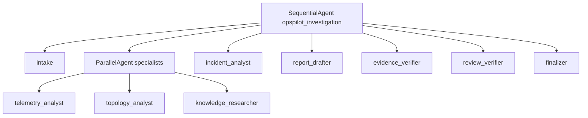
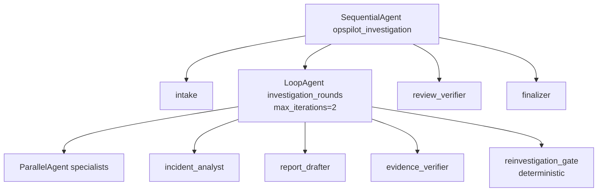
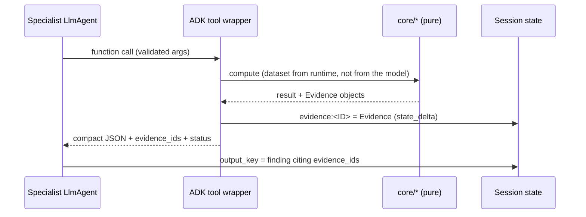

# Orchestration

## Pattern

| Decision | Choice | Why |
|---|---|---|
| Root coordinator | `SequentialAgent` (fixed) | Deterministic routing; every stage exactly once; structural termination; stable traces for tests/eval. |
| Explicit delegation to sub-agents | **Not used** | LLM transfer could skip or repeat specialists and recurse. All LLM agents are leaves with transfer disabled. |
| Parallel specialists | `ParallelAgent` for telemetry, topology, knowledge | Each needs only the intake scope; distinct output keys and content-addressed evidence keys → no write conflicts. Proven concurrent by `test_specialists_run_concurrently`. |
| Reconciliation | Sequential `incident_analyst` | Needs all three findings. |
| Synthesis then verification | `report_drafter` → `evidence_verifier` → `review_verifier` → `finalizer` | Verification checks the final draft; deterministic verifier first, LLM reviewer second; status decided by code. |
| Loops | None by default; optional bounded re-investigation (ADR-0002 amendment) | By default, verification failures produce `inconclusive`/`requires_human_review` plus `additional_evidence_requests` instead of re-running. With `OPSPILOT_MAX_INVESTIGATION_ROUNDS=2`, stages that failed get one more round (see below). |

## Optional re-investigation rounds

With `OPSPILOT_MAX_INVESTIGATION_ROUNDS=2` the middle of the tree becomes:

After each round, `reinvestigation_gate` (rules in `adk/rounds.py`) looks at
the stage outputs:

* No failed stage, a rejected request, or only budget-exhausted failures →
  `escalate`, which ends the loop.
* Otherwise, if a round is left, clear the failed stages and everything
  downstream of them, and let the loop run again. Completed specialists skip
  themselves, so only the failed stages and their dependents cost model calls.
* On the last round it always escalates without clearing anything, so the
  finalizer sees the final verification.

The decision and history are kept in the `investigation_rounds` state key and
surface as `run_metrics.investigation_rounds` / `run_metrics.retried_stages`.
Tests: `tests/test_reinvestigation.py`.

## Termination and bounds

* Structural: the root sequence has 7 stages; no agent has sub-agents to
  delegate to. With the optional loop, the inner stages run at most twice
  (`LoopAgent(max_iterations=2)`); `OPSPILOT_MAX_INVESTIGATION_ROUNDS` only
  accepts 1 or 2.
* Per-agent iteration cap (`max_llm_calls_per_agent`, default 8) — a runaway
  tool loop is cut off with a `failed` output (`test_runaway_agent_loop_is_capped`).
* Global caps: model calls (40, plus `RunConfig.max_llm_calls` backstop), tool
  calls (60), wall clock (120 s via `asyncio.timeout`).
* No unbounded retries: transient HTTP errors are retried by google-genai
  `HttpRetryOptions(attempts=2)`; anything else fails the stage.

## Contracts between stages

| Producer → consumer | State key | Contract |
|---|---|---|
| intake → all | `scope` | `InvestigationScope` |
| tools → verifier/report | `evidence:<ID>` | `Evidence` |
| specialists → analyst/drafter/verifier | `telemetry_finding`, `topology_finding`, `knowledge_finding` | `TelemetryFinding`, `TopologyFinding`, `KnowledgeFinding` |
| analyst → drafter/verifier | `incident_analysis` | `IncidentAnalysis` |
| drafter → verifier/reviewer | `report_draft` | `ReportDraft` |
| verifier → reviewer/finalizer | `verification` | `VerificationResult` |
| gate → finalizer (optional loop) | `investigation_rounds` | `{round, retried, stop_reason}` |
| reviewer → finalizer | `review` | `ReviewResult` |
| finalizer → caller | `final_report` | `InvestigationReport` |

ADK validates LLM outputs against `output_schema`; deterministic stages
re-validate everything they read and record `schema_violation` issues.

## Evidence flow

## Comparison with a LangGraph stateful workflow

See [PLAN.md §4](../PLAN.md#4-how-this-differs-from-a-langgraph-stateful-workflow).
