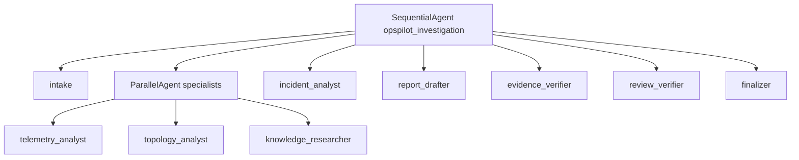
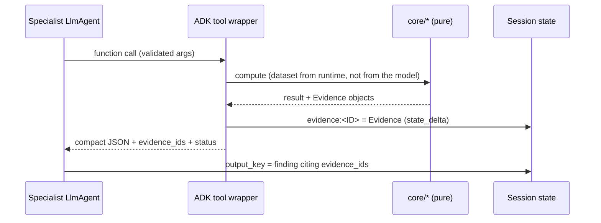

# Orchestration

## Pattern

| Decision | Choice | Why |
|---|---|---|
| Root coordinator | `SequentialAgent` (fixed) | Deterministic routing; every stage exactly once; structural termination; stable traces for tests/eval. |
| Explicit delegation to sub-agents | **Not used** | LLM transfer could skip or repeat specialists and recurse. All LLM agents are leaves with transfer disabled. |
| Parallel specialists | `ParallelAgent` for telemetry, topology, knowledge | Each needs only the intake scope; distinct output keys and content-addressed evidence keys → no write conflicts. Proven concurrent by `test_specialists_run_concurrently`. |
| Reconciliation | Sequential `incident_analyst` | Needs all three findings. |
| Synthesis then verification | `report_drafter` → `evidence_verifier` → `review_verifier` → `finalizer` | Verification checks the final draft; deterministic verifier first, LLM reviewer second; status decided by code. |
| Loops | None (`LoopAgent` deferred, ADR-0002) | Verification failures produce `inconclusive`/`requires_human_review` plus `additional_evidence_requests` instead of re-running. |

## Termination and bounds

* Structural: the root sequence has 7 stages; no agent has sub-agents to
  delegate to.
* Per-agent iteration cap (`max_llm_calls_per_agent`, default 8) — a runaway
  tool loop is cut off with a `failed` output (`test_runaway_agent_loop_is_capped`).
* Global caps: model calls (40, plus `RunConfig.max_llm_calls` backstop), tool
  calls (60), wall clock (120 s via `asyncio.timeout`).
* No unbounded retries: transient HTTP errors are retried by google-genai
  `HttpRetryOptions(attempts=2)`; anything else fails the stage.

## Contracts between stages

| Producer → consumer | State key | Contract |
|---|---|---|
| intake → all | `scope` | `InvestigationScope` |
| tools → verifier/report | `evidence:<ID>` | `Evidence` |
| specialists → analyst/drafter/verifier | `telemetry_finding`, `topology_finding`, `knowledge_finding` | `TelemetryFinding`, `TopologyFinding`, `KnowledgeFinding` |
| analyst → drafter/verifier | `incident_analysis` | `IncidentAnalysis` |
| drafter → verifier/reviewer | `report_draft` | `ReportDraft` |
| verifier → reviewer/finalizer | `verification` | `VerificationResult` |
| reviewer → finalizer | `review` | `ReviewResult` |
| finalizer → caller | `final_report` | `InvestigationReport` |

ADK validates LLM outputs against `output_schema`; deterministic stages
re-validate everything they read and record `schema_violation` issues.

## Evidence flow

## Comparison with a LangGraph stateful workflow

See [PLAN.md §4](../PLAN.md#4-how-this-differs-from-a-langgraph-stateful-workflow).
