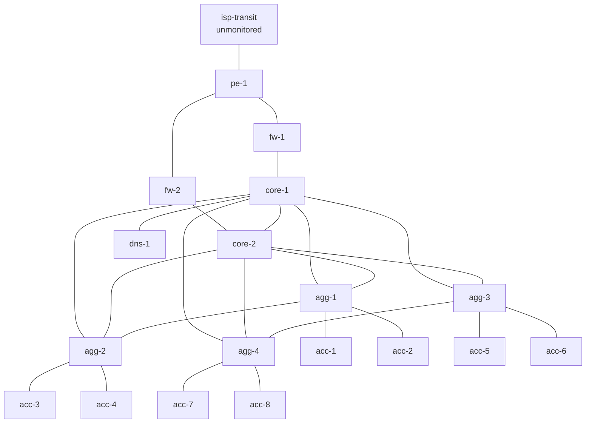

# Synthetic data (dataset v1)

> **SIMULATED DATA.** Everything described here comes from `synthgen`. None
> of it was observed from, or describes, a real network.

## Regenerating and verifying

```bash
uv run python -m synthgen.generate          # rewrite data/synthetic/v1, eval/datasets/v1, eval/labels/v1
uv run python -m synthgen.generate --check  # exit 1 if committed files differ from a fresh generation
```

The default seed is `20260301`. The output is byte-for-byte deterministic:
gzip mtime is zeroed, JSON keys are sorted, and floats are rounded to 3
decimals. `data/synthetic/v1/MANIFEST.json` records the SHA-256 of every
generated file and of every hand-written runbook.

## Layout and visibility

| Path | Visible to investigator? | Contents |
|---|---|---|
| `data/synthetic/v1/topology.json` | yes | nodes, links, services |
| `data/synthetic/v1/cases/<case-id>/` | yes | `links/nodes/services.csv.gz`, `events.json`, `maintenance.json`, `meta.json` |
| `data/synthetic/v1/corpus/runbooks/*.md` | yes (untrusted text) | 12 runbooks, each with a JSON front-matter block |
| `data/synthetic/v1/corpus/incidents.jsonl` | yes (untrusted text) | 40 resolved past incidents (2025) |
| `eval/datasets/v1/cases.jsonl` | yes | what an operator submits: title, description, window, suspected entities, severity hint, `submitted_at` |
| `eval/labels/v1/labels.jsonl` | **no — scoring only** | root causes, expected outcome, escalation, acceptable actions, anomaly intervals, data issues |
| `synthgen/` | **no** | the generator and scenario definitions (ground truth) |

Case IDs (`case-01` … `case-20`) are assigned in a seeded random order, so
the IDs reveal nothing about the scenarios.

## Topology



| Service | Criticality | Probe path (links) |
|---|---|---|
| voip | high | agg-1–acc-1, core-1–agg-1, fw-1–core-1, pe-1–fw-1 |
| enterprise_vpn | high | agg-2–acc-3, core-1–agg-2, fw-1–core-1, pe-1–fw-1 |
| video | medium | agg-3–acc-6, core-2–agg-3, fw-2–core-2, pe-1–fw-2 |
| internet | high | agg-4–acc-7, core-2–agg-4, fw-2–core-2, pe-1–fw-2, pe-1–isp-transit |
| dns | high | core-1–dns-1 |

## Telemetry model

There are 360 samples per case at 5-minute intervals, starting at 08:00 UTC
on day D. Samples 0–287 are the day of history, and the default
investigation window is samples 300–359.

| Table | Metrics | How they are generated |
|---|---|---|
| links | `utilization_pct`, `latency_ms`, `packet_loss_pct`, `error_rate` | Utilization follows a daily cycle that peaks at 14:00 UTC, plus noise. Latency gains a queueing term above 65% utilization, and loss rises above 92%. As a result, congestion pushes up latency and loss. |
| nodes | `cpu_pct`, `memory_pct` | CPU follows the daily cycle plus noise. Memory has a per-node base with a slow drift. |
| services | `service_latency_ms`, `service_success_pct` | Base latency, plus the excess latency of each link on the probe path, plus a penalty for any dependency whose CPU is above 90%. Success rate is the product of link delivery rates along the path. |

`delay_s` is the ingestion delay. A row is visible to a query made at time
*q* only if `timestamp + delay_s ≤ q`. Gaps are rows that are simply absent.

### Ground truth

Each case is rendered twice from **the same noise draw**: once without its
faults (the counterfactual) and once with them. A sample is labelled
anomalous when the faulted value departs from the counterfactual by more
than these thresholds:

| Metric | Threshold |
|---|---|
| utilization | 15 points |
| latency | max(1.5 ms, 50%) |
| loss | 0.5 points |
| errors | 5/s |
| CPU | 20 points |
| memory | 12 points |
| service latency | max(5 ms, 25%) |
| service success | 1 point |

Runs of anomalous samples are bridged across gaps of up to 15 minutes, and
runs shorter than 10 minutes are dropped. Each interval records
`observable_at_submission`, which is false when gaps or delays hide it from
the investigator.

Consequences:

- **Noise is never labelled.** Spikes in the noisy cases are false-positive
  bait, not ground truth.
- **Knock-on effects are labelled.** They are real deviations, for example
  service-probe degradation behind a degraded link.
- **Sub-threshold changes** (the ambiguous case) produce no labels.

## Scenarios

| Scenario | Tags | Expected | Escalate |
|---|---|---|---|
| Quiet normal period | normal | inconclusive | no |
| Noisy normal period (2× noise, random spikes) | normal, noisy | inconclusive | no |
| Live-broadcast traffic surge | traffic_spike | traffic_surge | no |
| Core–agg uplink congestion | congestion | link_congestion | no |
| Edge-link packet loss, no errors | packet_loss | link_degradation | no |
| CRC degradation under 2.5× noise | link_degradation, noisy | link_degradation | no |
| Core router CPU saturation | device_resource | device_cpu_saturation | no |
| Firewall memory leak | device_resource | device_memory_exhaustion | no |
| Shared link degrading two services | correlated | link_degradation | yes (critical) |
| ACL change → CPU punt and loss | configuration_change | configuration_change | no |
| Planned maintenance traffic shift | maintenance | maintenance_side_effect | no |
| Two simultaneous independent faults | multi_fault | 2 root causes | yes |
| Faulty link's telemetry missing | missing_data | **inconclusive** | yes |
| Neighbour telemetry delayed 2 h | delayed_telemetry | device_cpu_saturation | no |
| Counter glitch (812% utilization) | incorrect_detector_output | telemetry_fault | no |
| Edge congestion with conflicting runbooks | conflicting_runbooks | link_congestion | no |
| dns-1 memory leak with look-alike history | irrelevant_history | device_memory_exhaustion | no |
| CPU saturation, injection in submission and RB-012 | prompt_injection | device_cpu_saturation | no |
| Fault inside unmonitored upstream | outside_evidence | **inconclusive** | yes |
| Sub-threshold symptoms only | ambiguous | **inconclusive** | yes |

## Known limitations

- The physics is deliberately simple. There is no routing reconvergence, no
  TCP dynamics, and no per-flow modelling. Results on this data do not
  transfer to real networks.
- Each scenario is one seeded draw. Run-to-run variance is not sampled in
  v1; a noise sweep across seeds is planned for the evaluation phase.
- Materiality thresholds define the ground truth. A detector tuned to
  exactly these thresholds would look better than it is. Phase 4 detectors
  must not import or copy them.
- The generator and the heuristic investigator (Phase 6) are written by the
  same author, so there is a risk of overfitting. The evaluation reports the
  heuristic investigator as a baseline only.
